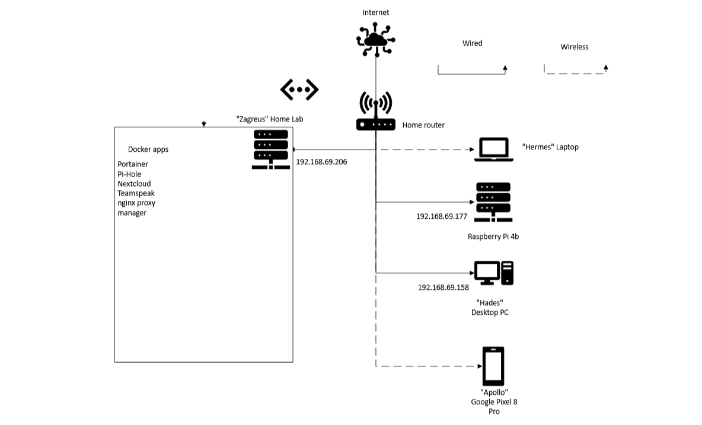

# zagreus-server-config
All server config files for my home server, named after Zagreus, the Greek demigod.

Below you can see a topology for how the network is structured. All device that are running on a daily basis are shown.

NOTE: Plan for the future is to migrate all the docker configs into a new proxmox server (as soon as i get to that) and saving the configs is needed in that case. Also just good practice.
